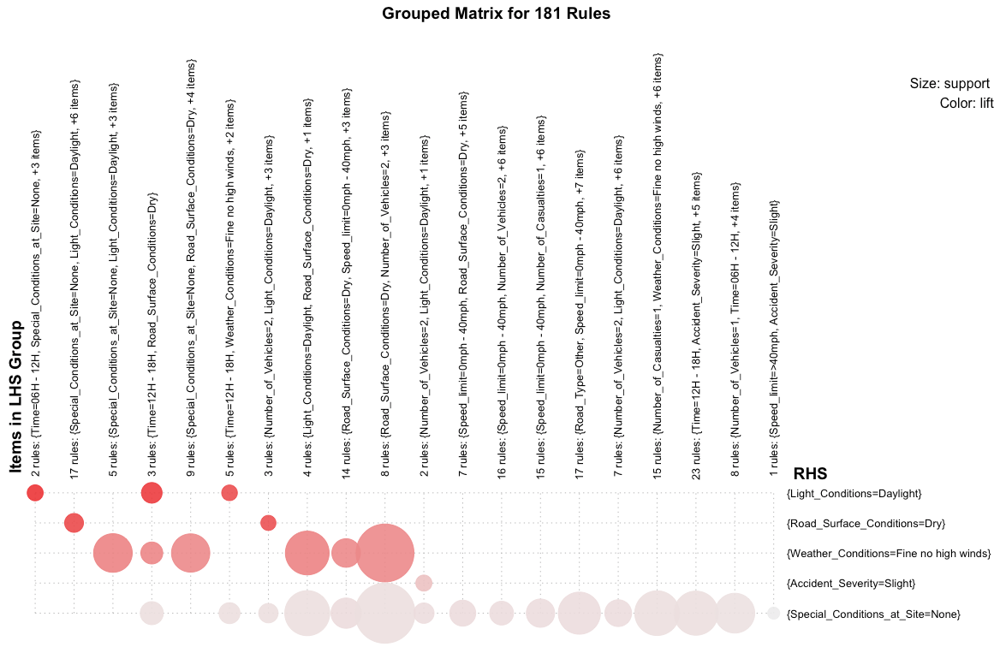

<html>
<body>
<h1 style="text-align: center"> Road Accidents in UK (2015) </h1>
<h2 style="text-align: center"> Data Mining II </h2>
<br />
<p style="text-align: center"> <i>Joel Sousa up201103870</i> </p>
<p style="text-align: center"> <i>Luis Moreira up201102786</i> </p>
<p style="text-align: center"> <i>Pavel Kajaba up201610230</i> </p>
<p style="text-align: center"> <i>Pedro Osório up201102741</i> </p>

<hr />
<!-- Introduction -->
<h4> Introduction </h4>
<p> As we all may know thousands of people die every year due to Road Accidents and Accident's Data has been growing exponentional. Our job as Data Mining Engineers is to find as many rules as we can that better describes the main reasons that tell us: "Why are those Accidents happening?".
To accomplish that task we're going to use the Apriori algorithm and we're going to set minsup (minimum support) and minconf (minimum confidence) values to generate rules and we're going to choose them looking for lift values grater than 1,1.
It's very important to do this kind of work as we might find solutions to avoid so many accidents that are happening in the United Kingdom (2015). </p>
<!--
Colunas eliminadas do dataset:
- Accident_Index FEITO
- Location_Easting_OSGR FEITO
- Locating_Northing_OSGR FEITO
- Longitude FEITO
- Latitude FEITO
- Police Force FEITO
- Local_Authority_Highway FEITO
- 1st_Road_Class FEITO
- 1st_Road_Number FEITO
- Junction_Detail FEITO
- Junction_Control FEITO
- 2nd_Road_Class FEITO
- 2nd_Road_Number FEITO
- Pedestrian_Crossing.Human_Control (Tudo a 0s) FEITO
- Pedestrian_Crossing.Physical_Facilities (Tudo a 0s) FEITO
- Carriageway_Hazards FEITO
- Urban_or_Rural_Area FEITO
- Did_Police_Officer_Attend_Scene_of_Accident FEITO
- LSOA_of_Accident_Location FEITO
-->
<p> As long as we were analysing our dataset, we've felt that some of the variables don't restrain our main goal: to find as much interesting rules as we can that show us why, when and how these accidentes are happening. As so, these were the variables that we've considered that we could remove: </p>
<ul>
<li> <b>Accident_Index -</b> It was removed because it's not important for the mining task to know the Accident_Index. </li>

<li> <b>Location_Easting_OSGR -</b> We've decided to not keep any of accident location-related variable so all of them were removed, including Location_Northing_OSGR, Longitude, Latitude, LSOA_of_Accident_Location , Local_Authority_Highway and  Local_Authority_District.</li>

<li> <b>Locating_Northing_OSGR -</b> Same reason as we've presented.</li> 

<li> <b>Longitude -</b> Same reason as we've presented above. </li>

<li> <b>Latitude -</b> Same reason as we've presented above.</li>

<li> <b>LSOA_of_Accident_Location -</b> Same reason as we've presented above. </li>

<li> <b>Local_Authority_Highway -</b> Same reason as we've presented above.</li>

<li> <b>Local_Authority_District -</b> Same reason as we've presented above.</li>

<li> <b> Police Force -</b> We've felt that any Police-related information wasn't important to our extracted data set. </li>

<li> <b>1st_Road_Class -</b> Considering Road's characteristics, we've only selected Road_Type as a main item that describes Accident's road. </li>

<li> <b>1st_Road_Number -</b> We've considered that it's more important to take care of Road_Type instead of Road_Number.</li>

<li> <b>2nd_Road_Class -</b> Considering Road's characteristics, we've only selected Road_Type as a main item that describes Accident's road. </li> 

<li> <b>2nd_Road_Number -</b> We've considered that it's more important to take care of Road_Type instead of Road_Number.</li>

<li> <b>Junction_Detail -</b> Both Junction_Detail and Junction_Control are similar to Road_Type information so we've decided to delete them. </li>

<li> <b>Junction_Control -</b> Same reason as we've presented above. </li>

<li> <b>Pedestrian_Crossing.Human_Control -</b> Most of values were zero so we've decided that this column was not so relevant </li>

<li> <b>Pedestrian_Crossing.Physical_Facilitiesl -</b> Same reason as we've presented above. </li>

<li> <b>Carriageway_Hazards -</b> Most of values were none so we've also removed this column </li> 

<li> <b>Urban_or_Rural_Area -</b> we haven't considered this column so important for rules generation so we've removed it. </li>

<li> <b>Did_Police_Officer_Attend_Scene_of_Accident -</b> The presence of a Police officer at the scene of accident won't help us on finding patterns that explain why that same accident actually had happened. For that reason we've removed this variable.</li> 

<li> <b>Weather_Conditions -</b> After a carefull analysis we've decided to remove this column because all values we're zero so it won't affect so much our rules generation. </li>
</ul>

<hr />

<h4> Pratical Work </h4>

<h5> Data Mining </h5>

``` {r setup, include=FALSE}
knitr::opts_chunk$set(echo = FALSE)
library(arules)
library(arulesViz)
library(dplyr)
library(ggplot2)
library(foreign)
library(xlsx)
library(lubridate)
```
<!-- Read Data Set -->
``` {r readin}
dt <- read.csv("dataset.csv", header = TRUE)
data_set <-dt[,c(2:13)]
```
<!-- Dataset summary -->
<p> Our Data Set contains multiples instances related to Accident's information. After an extended analysis and removing a lot of, what we've considered, unnecessary data, we can present our final result. Our final Data Set has information related to, for example, <b><i>Date</i></b>: We can observe that had happened more accidents during the 3rd Trimester. </p>

``` {r echo =TRUE}
head(summary(data_set))
```

<p> Now we're going to apply the Aprior algorithm on our Data Set and the following rules were obtained. The result is a set of <b>2724 rules</b>. We're about to reduce the size of this set by adjusting minsup and minconf values. </p>

``` {r  results="hide", message = FALSE, warning = FALSE, echo = TRUE }
rules <- apriori(data_set,parameter=list(support=0.2, confidence=0.5))
rules
```

<p> First we're going to plot our data set and then analyse which range of confidence and support have the better rules (with a good lift value). </p>

``` {r  results="hide", message = FALSE, warning = FALSE, echo = TRUE }
plot(rules)
```

<p> As we can observe, best rules have minsup values between [0.2 , 0.3], and minconf values between [0.8 , 1.0]. So, now we're about to adjust our aprior algorithm by changing minsup and minconf values, and also by adding an extra option: <b> minlen = 3 </b>. This option allow us to choose rules with a minimum length of 3. </p>

``` {r  results="hide", message = FALSE, warning = FALSE, echo = TRUE }
rules <- apriori(data_set,parameter=list(support=0.25, confidence=0.85, minlen=3))
```

<p> As we can see we've obtained a set of 653 rules, even though a lot less then 2724 we still need to adjust the apriori algorithm a little bit more. First things first, lets analyse our new set of rules by using a plot. </p>

``` {r  results="hide", message = FALSE, warning = FALSE, echo = TRUE }
plot(rules)
```
<p> As we can observe, best rules have minsup values between [0.2 , 0.3], and minconf values between [0.9 , 1.0]. So, now we're about to adjust our aprior algorithm by changing minsup and minconf values. </p>

``` {r  results="hide", message = FALSE, warning = FALSE, echo = TRUE }
rules <- apriori(data_set,parameter=list(support=0.25, confidence=0.9, minlen=3))
```

<p> We've obtained a set of 355 rules and we're going to reduce this number by removing all redundant rules: if we have <i>{A,B,C} => {D}</i> and <i> {A,B} => {D}</i>, we can remove the second one because it derivates from the first one.</p>

``` {r  results="hide", message = FALSE, warning = FALSE, echo = TRUE }
rules<-rules[!is.redundant(rules)]
summary(rules)
```

<p> By doing this step we're able to reduce our set size in <b>49% !</b>. Now we have a set of 181 rules. <br /> We're going to analyse this new rule set by using a <i>baloon plot</i>: LHS (antecedent) on x-axis and RHS (consequent) on y-axis. Balloon's color represent the aggregated interest measure in the group with a certain consequent, and balloon's color shows the aggregated support. <br />
Now we're going to filter our rule set by lift using a value grater then 1.1 (lift > 1.1). The reason why we've used lift to filter our set is that with lift we can measure the performance of a targeting model (association rule). So for values of lift greater then 1 we can ensure that they are independent (antecedent and consequent). </p>

<div>

</div>

<p> So let's filter our rule set. </p>

``` {r  results="hide", message = FALSE, warning = FALSE, echo = TRUE }
subrules <- rules[quality(rules)$lift >= 1.1]
summary(subrules)
plot(subrules)
```

<p> Only 53 rules are present in our rule set and all of them are good one with a good lift value. Let's use a plot using support and lift instead of support and confidence (lift on y-axis). </p>

``` {r  results="hide", message = FALSE, warning = FALSE, echo = TRUE }
plot(rules, measure=c("support", "lift"), shading="confidence")
```

<p> Now we're about to order our rule set by lift and plot it using a <i>Two-key plot</i>. Here order represents, for example, the number of items in a rule.</p>

``` {r  results="hide", message = FALSE, warning = FALSE, echo = TRUE }
plot(rules, shading="order", control=list(main = "Two-key plot"))
```

<p> After using a matrix plot method using the following command,<i>plot(subrules, method="matrix", measure="lift")</i>, we're able to obtain an output of our rule set: </p>

<div>
<p>
Itemsets in Antecedent (LHS)

 [1] "{Time=06H - 12H,Special_Conditions_at_Site=None}"                                                                                                                          
 [2] "{Time=12H - 18H,Road_Surface_Conditions=Dry}"                                                                                                                              
 [3] "{Time=12H - 18H,Weather_Conditions=Fine no high winds}"                                                                                                                    
 [4] "{Number_of_Vehicles=2,Road_Surface_Conditions=Dry}"                                                                                                                        
 [5] "{Speed_limit=0mph - 40mph,Road_Surface_Conditions=Dry}"                                                                                                                    
 [6] "{Light_Conditions=Daylight,Road_Surface_Conditions=Dry}"                                                                                                                   
 [7] "{Road_Type=Other,Road_Surface_Conditions=Dry}"                                                                                                                             
 [8] "{Number_of_Casualties=1,Road_Surface_Conditions=Dry}"                                                                                                                      
 [9] "{Accident_Severity=Slight,Road_Surface_Conditions=Dry}"                                                                                                                    
[10] "{Road_Surface_Conditions=Dry,Special_Conditions_at_Site=None}"                                                                                                             
[11] "{Time=12H - 18H,Weather_Conditions=Fine no high winds,Road_Surface_Conditions=Dry}"                                                                                        
[12] "{Time=12H - 18H,Light_Conditions=Daylight,Weather_Conditions=Fine no high winds}"                                                                                          
[13] "{Time=12H - 18H,Road_Type=Other,Weather_Conditions=Fine no high winds}"                                                                                                    
[14] "{Accident_Severity=Slight,Time=12H - 18H,Weather_Conditions=Fine no high winds}"                                                                                           
[15] "{Number_of_Vehicles=2,Speed_limit=0mph - 40mph,Road_Surface_Conditions=Dry}"                                                                                               
[16] "{Number_of_Vehicles=2,Light_Conditions=Daylight,Road_Surface_Conditions=Dry}"                                                                                              
[17] "{Number_of_Vehicles=2,Road_Type=Other,Road_Surface_Conditions=Dry}"                                                                                                        
[18] "{Number_of_Vehicles=2,Road_Surface_Conditions=Dry,Special_Conditions_at_Site=None}"                                                                                        
[19] "{Speed_limit=0mph - 40mph,Light_Conditions=Daylight,Weather_Conditions=Fine no high winds}"                                                                                
[20] "{Road_Type=Other,Speed_limit=0mph - 40mph,Road_Surface_Conditions=Dry}"                                                                                                    
[21] "{Accident_Severity=Slight,Speed_limit=0mph - 40mph,Road_Surface_Conditions=Dry}"                                                                                           
[22] "{Speed_limit=0mph - 40mph,Road_Surface_Conditions=Dry,Special_Conditions_at_Site=None}"                                                                                    
[23] "{Road_Type=Other,Light_Conditions=Daylight,Road_Surface_Conditions=Dry}"                                                                                                   
[24] "{Light_Conditions=Daylight,Road_Surface_Conditions=Dry,Special_Conditions_at_Site=None}"                                                                                   
[25] "{Road_Type=Other,Road_Surface_Conditions=Dry,Special_Conditions_at_Site=None}"                                                                                             
[26] "{Accident_Severity=Slight,Time=12H - 18H,Light_Conditions=Daylight,Weather_Conditions=Fine no high winds}"                                                                 
[27] "{Time=12H - 18H,Light_Conditions=Daylight,Weather_Conditions=Fine no high winds,Special_Conditions_at_Site=None}"                                                          
[28] "{Number_of_Vehicles=2,Road_Type=Other,Speed_limit=0mph - 40mph,Road_Surface_Conditions=Dry}"                                                                               
[29] "{Number_of_Vehicles=2,Speed_limit=0mph - 40mph,Road_Surface_Conditions=Dry,Special_Conditions_at_Site=None}"                                                               
[30] "{Number_of_Vehicles=2,Road_Type=Other,Light_Conditions=Daylight,Road_Surface_Conditions=Dry}"                                                                              
[31] "{Number_of_Vehicles=2,Number_of_Casualties=1,Light_Conditions=Daylight,Weather_Conditions=Fine no high winds}"                                                             
[32] "{Number_of_Vehicles=2,Light_Conditions=Daylight,Road_Surface_Conditions=Dry,Special_Conditions_at_Site=None}"                                                              
[33] "{Number_of_Vehicles=2,Road_Type=Other,Road_Surface_Conditions=Dry,Special_Conditions_at_Site=None}"                                                                        
[34] "{Road_Type=Other,Speed_limit=0mph - 40mph,Light_Conditions=Daylight,Weather_Conditions=Fine no high winds}"                                                                
[35] "{Number_of_Casualties=1,Speed_limit=0mph - 40mph,Light_Conditions=Daylight,Weather_Conditions=Fine no high winds}"                                                         
[36] "{Accident_Severity=Slight,Speed_limit=0mph - 40mph,Light_Conditions=Daylight,Weather_Conditions=Fine no high winds}"                                                       
[37] "{Speed_limit=0mph - 40mph,Light_Conditions=Daylight,Weather_Conditions=Fine no high winds,Special_Conditions_at_Site=None}"                                                
[38] "{Accident_Severity=Slight,Road_Type=Other,Speed_limit=0mph - 40mph,Road_Surface_Conditions=Dry}"                                                                           
[39] "{Road_Type=Other,Speed_limit=0mph - 40mph,Road_Surface_Conditions=Dry,Special_Conditions_at_Site=None}"                                                                    
[40] "{Accident_Severity=Slight,Speed_limit=0mph - 40mph,Road_Surface_Conditions=Dry,Special_Conditions_at_Site=None}"                                                           
[41] "{Road_Type=Other,Light_Conditions=Daylight,Road_Surface_Conditions=Dry,Special_Conditions_at_Site=None}"                                                                   
[42] "{Number_of_Vehicles=2,Number_of_Casualties=1,Light_Conditions=Daylight,Weather_Conditions=Fine no high winds,Special_Conditions_at_Site=None}"                             
[43] "{Number_of_Casualties=1,Road_Type=Other,Speed_limit=0mph - 40mph,Light_Conditions=Daylight,Weather_Conditions=Fine no high winds}"                                         
[44] "{Accident_Severity=Slight,Road_Type=Other,Speed_limit=0mph - 40mph,Light_Conditions=Daylight,Weather_Conditions=Fine no high winds}"                                       
[45] "{Road_Type=Other,Speed_limit=0mph - 40mph,Light_Conditions=Daylight,Weather_Conditions=Fine no high winds,Special_Conditions_at_Site=None}"                                
[46] "{Accident_Severity=Slight,Number_of_Casualties=1,Speed_limit=0mph - 40mph,Light_Conditions=Daylight,Weather_Conditions=Fine no high winds}"                                
[47] "{Number_of_Casualties=1,Speed_limit=0mph - 40mph,Light_Conditions=Daylight,Weather_Conditions=Fine no high winds,Special_Conditions_at_Site=None}"                         
[48] "{Accident_Severity=Slight,Speed_limit=0mph - 40mph,Light_Conditions=Daylight,Weather_Conditions=Fine no high winds,Special_Conditions_at_Site=None}"                       
[49] "{Accident_Severity=Slight,Road_Type=Other,Speed_limit=0mph - 40mph,Road_Surface_Conditions=Dry,Special_Conditions_at_Site=None}"                                           
[50] "{Number_of_Casualties=1,Road_Type=Other,Speed_limit=0mph - 40mph,Light_Conditions=Daylight,Weather_Conditions=Fine no high winds,Special_Conditions_at_Site=None}"         
[51] "{Accident_Severity=Slight,Road_Type=Other,Speed_limit=0mph - 40mph,Light_Conditions=Daylight,Weather_Conditions=Fine no high winds,Special_Conditions_at_Site=None}"       
[52] "{Accident_Severity=Slight,Number_of_Casualties=1,Speed_limit=0mph - 40mph,Light_Conditions=Daylight,Weather_Conditions=Fine no high winds,Special_Conditions_at_Site=None}"

Itemsets in Consequent (RHS)

[1] "{Light_Conditions=Daylight}"             "{Weather_Conditions=Fine no high winds}" "{Road_Surface_Conditions=Dry}"  
</p>
</div>

<p> The following plot presents a more clearly view of our rule set. Unfortunately they use to be a little bit confuse because items start to clutter. So for this plot we've chosen the top 7 rules (with highest lift value). </p>

``` {r  results="hide", message = FALSE, warning = FALSE, echo = TRUE }
subrules2 <- head(sort(rules, by="lift"), 7)
plot(subrules2, method="graph")
```

<hr />

<h4> Conclusion </h4>

<p>
During this assignment we've always tried to simplify the view of our rule set. One of our main problems resides on the Apriori Algorithm: As much as we try to generate good enough rules this algorithm had always generated rules with only one consequent (RHS), even though we had changed minsup and minconf values. To avoid this issue we've decided to present 10 random rules and 10 rules that were chosen by us. <br />
</p>

<h5> 10 Random Rules </h5>

``` {r message = FALSE, warning = FALSE, echo = TRUE }
tenRandom <- sample(rules, 10)
tenRandom <- sort(tenRandom, decreasing = TRUE, by = "lift")
inspect(tenRandom)
```

<h5> 10 Selected Rules </h5>
<p> RHS- Accident severity = "Serious" </p>
``` {r  results="hide", message = FALSE, warning = FALSE, echo = TRUE }
rules_fatal<-apriori(data_set,parameter = list(support=0.02,confidence=0.2,minlen=3),appearance = list(rhs=c("Accident_Severity=Serious"),default="lhs"))
rules_fatal<-rules_fatal[!is.redundant(rules_fatal)]
subrules_fatal <- rules_fatal[quality(rules_fatal)$lift >= 1.1]
subrules_fatal <- head(sort(rules_fatal, by="lift"), 3)
```
``` {r resultmessage = FALSE, warning = FALSE, echo = TRUE }
inspect(subrules_fatal)
```

<p> RHS - Number of casualties = 2 </p>
``` {r results="hide", message = FALSE, warning = FALSE, echo = TRUE }
rules_casualties<-apriori(data_set,parameter = list(support=0.02,confidence=0.2,minlen=3),appearance = list(rhs=c("Number_of_Casualties=2"),default="lhs"))
rules_casualties<-rules_casualties[!is.redundant(rules_casualties)]
subrules_casualties <- rules_casualties[quality(rules_casualties)$lift >= 1.1]
subrules_casualties <- head(sort(rules_casualties, by="lift"), 2)

```
``` {r message = FALSE, warning = FALSE, echo = TRUE }
inspect(subrules_casualties)
```

<p> RHS - What time? </p>
``` {r results="hide", message = FALSE, warning = FALSE, echo = TRUE }
rules_hour<-apriori(data_set,parameter = list(support=0.01,confidence=0.7,minlen=3),appearance = list(rhs=c("Time=00H - 06H","Time=06H - 12H","Time=12H - 18H","Time=18H - 24H"),default="lhs"))
rules_hour<-rules_hour[!is.redundant(rules_hour)]
subrules_hour <- rules_hour[quality(rules_hour)$lift >= 1.1]
subrules_hour <- head(sort(rules_hour, by="lift"), 4)

```
``` {r message = FALSE, warning = FALSE, echo = TRUE }
inspect(subrules_hour)
```

<p> RHS - Number of Vehicles = 3 </p>
``` {r results="hide", message = FALSE, warning = FALSE, echo = TRUE }
rules_vehicles<-apriori(data_set,parameter = list(support=0.01,confidence=0.1,minlen=3),appearance = list(rhs=c("Number_of_Vehicles=3"),default="lhs"))
rules_vehicles<-rules_vehicles[!is.redundant(rules_vehicles)]
subrules_vehicles <- rules_vehicles[quality(rules_vehicles)$lift >= 1.1]
subrules_vehicles <- head(sort(rules_vehicles, by="lift"), 2)

```
``` {r message = FALSE, warning = FALSE, echo = TRUE }
inspect(subrules_vehicles)
```

<p> RHS - Accident severity = "Slight" </p>
``` {r results="hide", message = FALSE, warning = FALSE, echo = TRUE }
rules_slight<-apriori(data_set,parameter = list(support=0.03,confidence=0.9,minlen=3),appearance = list(rhs=c("Accident_Severity=Slight"),default="lhs"))
rules_slight<-rules_slight[!is.redundant(rules_slight)]
subrules_slight <- rules_fatal[quality(rules_slight)$lift >= 1.1]
subrules_slight <- head(sort(rules_slight, by="lift"), 3)
```
``` {r message = FALSE, warning = FALSE, echo = TRUE }
inspect(subrules_slight)
```

<p> We hope that our mining help others to find interesting patterns that can help to decrease the Accident's rate in the United Kingdom. We've felt some dificulties due to larger data information available but at the end we think that we've done a good work. We would like also to thank to our teacher for the assistance provided during this assignment. </p>
<br />

</body>
</html>
